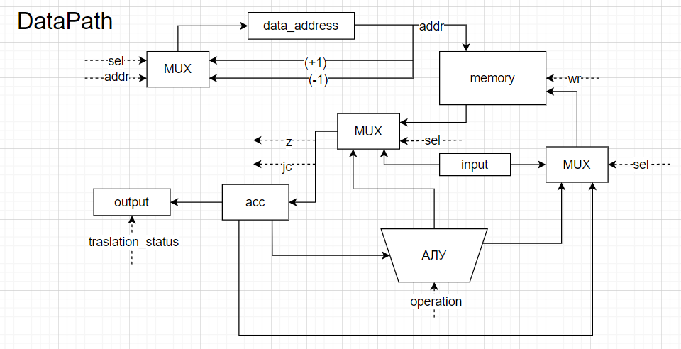

# Asm. Транслятор и модель

- Филатов Фёдор Романович
- `asm | cisc -> risc | neum | hw | instr | struct | stream | port | cstr | prob1 | cache`
- Без усложнения.


## Язык программирования

``` ebnf
<program> ::= { <line> }

<line> ::= <label> [ <comment> ] "\n"
       | <instr> [ <comment> ] "\n"
       | <instr_with_variable_number_of_arguments> [ <comment> ] "\n"
       | <instr_with_jump> [ <comment> ] "\n"
       | [ <comment> ] "\n"

<label> ::= <label_name> ":"

<instr> ::= "halt"
        | "mov" <register>
        | "mov" <address>
        | "lend" <register> <address>
        | "lend <address> <register>
        | "inc" <register>
        | "inc" <address>
        | "dec" <register>
        | "dec" <address>
        | "rmd" <register> <register> <address>
        | "rmd" <address> <address> <register> <register> <address>
        | "cmp" <register> <register>
        | "cmp" <address> <address> <register> <register> <address>
        | "in" <port>
        | "in" <port> <address>
        | "out" <port> <type>

<instr_with_variable_number_of_arguments> ::= "add" <args>
      | "sub" <args>
      | "mul" <args>
      | "div" <args>

<instr_with_jump> ::= "jmp" <jmp_address>
      | "jz" <jmp_address>
      | "je" <jmp_address>
      | "jb" <jmp_address>
      | "jl" <jmp_address>

<comment> ::= ";" <any symbols except "\n">

<label_name> ::= <any symbols from [a-zA-Z_] more than once and any symbols from [0-9] zero or more times>

<register> ::= <"r" and number from 0 to 12>

<address> ::= <"@" and number from 0 to 70>

<port> ::= 0 | 1

<type> ::= "str" | "numb"

<args> ::= <<address> two or more times> <register> <register> <address>

<jmp_address> ::= <label_name> | address
```
Поддерживаются однострочные комментарии, начинающиеся с ;.
Код выполняется последовательно, одна инструкция за другой.
В строковых переменных перенос строки обозначается специальным символом `$`.

Список доступных инструкций см. [система команд](#система-команд)

## Организация памяти

Модель памяти процессора:

+ Фон-Неймановская архитектура – общая память для инструкций и данных
+ Размер машинного слова не определен (данные в памяти представляют собой структуры данных)
+ В случае переполнения регистров доступной памяти в начале выполнения будет выброшено исключение

Память адресуется двумя регистрами:
+ `ar` – регистр адреса для обращения к памяти из DataPath
+ `ap` – регистр адреса для обращения к памяти из ControlUnit

### Организация памяти при выполнении
```text
           Registers
+------------------------------+
| r0                           |
| ...                          |
| r12                          |
| or                           |
| oc                           |
| jr                           |
| lr                           |
| rr                           |
+------------------------------+

Регистры `r0-r12` доступные программисту
`or` -- `r13`, хранит элемент, который подлежит выводу
`oc` -- `r14`, хранит условие вывода: 0 - делаем вывод из регистра, адрес которого лежит в `lr`, 1 - загружаем значение из памяти в `lr`, а потом это значение выводим
`jr` -- `r15`, хранит условие перехода для команд `jz`, `je`, `jl`, `jb`
`lr` -- `r16`, хранит адрес регистра, который подается на левый вход в алу
`rr` -- `r17`, хранит адрес регистра, который подается на правый вход в алу

  Instruction and data memory
+------------------------------+
| 00   : program start         |
|     ...                      |
| n    : hlt                   |
| n+1  : value                 |
| n+2  : value                 |
|     ...                      |
+------------------------------+
```
В языке отсутствуют константы и литералы. Можно создавать переменные в части кода, которая идет после `.data:`.
Численные переменные занимаю одну ячейку памяти, строковые переменные хранятся последовательно в памяти и оканчиваются
специальным символом `\0`.

В коде программы к переменным можно обращаться по имени, которое задается в `.data:`. В процессе трансляции все имена 
переменных заменяются на адреса этих переменных в памяти.


## Система команд

Особенности процессора:

- Машинное слово -- не определено (CISC архитектура).
- Доступ к памяти для получения данных осуществляется по адресу, хранящемуся в специальном регистре `data_address`. 
- Доступ к текущей инструкции осуществляется по адресу, хранящемуся в специальном регистре `program_address`.
- Доступна прямая и неявная установка адреса:
  - Прямая установка адреса доступна при помощи команд `jmp`, `jz`, `je`, `jl`, `jb`, `mov`
  - Неявная установка адреса осуществляется внутри команд операторов, команд переходов и внутри команд загрузки, выгрузки памяти.
- Обработка данных происходит при помощи операторов `inc`, `dec`, `add`, `sub`, `mul`, `div`, `rmd`
- Поток управления:
    - инкремент `pc` после каждой инструкции;
    - условный (`jz`, `je`, `jb`, `jl`) и безусловный (`jmp`, `mov`) переходы
    - `step_counter` для выполнения команд требующих больше одного такта  
- Устройства ввода вывода используется при помощи портов
    - Для доступа к устройству вывода используется команда `out { port, type }`
    - Для доступа к устройству ввода используется команда `in { port }`, `in { port, address }`

Набор инструкций:

- `lend { address, register }` -- загрузить элемент из указанной ячейки памяти в указанный регистр
- `lend { register, address }` -- загрузить элемент из указанного регистра в указанную ячейку памяти
- `mov { address }` -- безусловный переход по заданному адресу (используется для DataPath)
- `mov { register }` -- установить адрес регистра, который будет подаваться на левый вход алу (используется для DataPath)
- `inc { address }` -- увеличить значение в указанной ячейке памяти на 1
- `inc { register }` -- увеличить значение в указанном регистре на 1
- `dec { address }` -- уменьшить значение в указанной ячейке памяти на 1
- `dec { register }` -- уменьшить значение в указанном регистре на 1
- `add { el1_addr, el2_addr, reg_1, reg_2, address }` -- сложить произвольное количество элементов из памяти и положить в ячейку по указанному адресу; 
элементы берутся слева направо и складываются в указанные регистры; каждый результат вычисления складывается в регистр `reg_1`; 
каждый следующий элемент складывается в регистр `reg_2`; конечный результат вычислений из регистра `reg_1` записывается в ячейку с адресом `address`
- `sub { el1_addr, el2_addr, reg_1, reg_2, address }` -- вычесть произвольное количество элементов из памяти и положить в ячейку по указанному адресу; 
элементы берутся слева направо и складываются в указанные регистры; каждый результат вычисления складывается в регистр `reg_1`; 
каждый следующий элемент складывается в регистр `reg_2`; конечный результат вычислений из регистра `reg_1` записывается в ячейку с адресом `address`
- `mul { el1_addr, el2_addr, reg_1, reg_2, address }` -- перемножить произвольное количество элементов из памяти и положить в ячейку по указанному адресу; 
элементы берутся слева направо и складываются в указанные регистры; каждый результат вычисления складывается в регистр `reg_1`; 
каждый следующий элемент складывается в регистр `reg_2`; конечный результат вычислений из регистра `reg_1` записывается в ячейку с адресом `address`
- `div { el1_addr, el2_addr, reg_1, reg_2, address }` -- поделить произвольное количество элементов из памяти и положить в ячейку по указанному адресу; 
элементы берутся слева направо и складываются в указанные регистры; каждый результат вычисления складывается в регистр `reg_1`; 
каждый следующий элемент складывается в регистр `reg_2`; конечный результат вычислений из регистра `reg_1` записывается в ячейку с адресом `address`
- `rmd { reg_1, reg_2, address }` -- найти остаток от деления значений из `reg_1` и `reg_2` и положить в ячейку по адресу `address`
- `rmd { el1_addr, el2_addr, reg_1, reg_2, address }` -- найти остаток от деления el1 на el2 и положить в ячейку по указанному адресу;
элементы берутся слева направо и складываются в указанные регистры; результат вычисления складывается в регистр `reg_1`, 
а после записывается в ячейку с адресом `address`
- `cmp { reg_1, reg_2 }` -- сравнить два значения из указанных регистров
- `cmp { el1_addr, el2_addr, reg_1, reg_2 }` -- сравнить два значения из памяти; элементы берутся слева направо и складываются в указанные регистры, 
далее сравниваются два значения в указанных регистрах
- `jmp { lable | address }` -- безусловный переход по заданному адресу или метке (используется для ControlUnit)
- `jz { lable | address }` -- условный переход по заданному адресу или метке, если регистр `jr` равен ноль
- `je { lable | address }` -- условный переход по заданному адресу или метке, если в команде `cmp` первый элемент равен второму элементу
- `jb { lable | address }` -- условный переход по заданному адресу или метке, если в команде `cmp` первый элемент больше второго элемента
- `jl { lable | address }` -- условный переход по заданному адресу или метке, если в команде `cmp` первый элемент меньше второго элемента
- `in { port }` -- ввести извне значение и сохранить в `or` (символ)
- `in { port, address }` -- ввести извне значение и сохранить в память начиная с указанной ячейки (последовательность символов)
- `out { port, type }` -- напечатать значение из текущей ячейки (символ), предварительно загрузив его в `or`, или 
напечатать текущее значение `or` (условие выбора алгоритма хранится в `oc`)
- `halt` -- завершить выполнение программы

### Кодирование инструкций

- Машинный код сериализуется в список JSON.
- Один элемент списка -- одна инструкция.
- Индекс списка -- адрес инструкции. Используется для команд перехода.

Пример:

```json
[
  {
    "index": 0, 
    "operation": "add", 
    "arg": ["@21", "@22", "@23", "r0", "r1", "@30"]
  }
]
```

где:
- `index` -- адрес ячейки в памяти
- `operation` -- строка с кодом операции;
- `arg` -- аргумент (может отсутствовать, может быть несколько);

## Транслятор

Интерфейс командной строки: `translator.py <input_file> <target_file>`

Реализовано в модуле: [translator](translator.py)

Этапы трансляции (функция `main`):

1. Избавление от комментариев и лишних пробелов
2. Генерация машинного кода без адресов перехода, без адресов переменных
3. Подстановка адресов перехода и адресов переменных в инструкции

## Модель процессора

Интерфейс командной строки: `machine.py <machine_code_file> <input_file>`

Реализовано в модуле: [machine](./machine.py).

### DataPath



Реализован в классе [DataPath](./data_path.py)

`memory` -- однопортовая память, поэтому либо читаем, либо пишем.

Сигналы (обрабатываются за один такт, реализованы в виде методов класса):

- `latch_addr` -- защёлкнуть выбранное значение в `data_addr`;
- `latch_reg_n` -- защёлкнуть в n-ый регистр выбранное значение;
  - выход из памяти
  - результат операции в алу
  - значение из порта ввода 
- `wr` -- записать значение в память;
  - выход из аккумулятора
  - результат операции в алу
  - значение из порта ввода
- `ot` -- вывести значение из памяти;
- `signal_output` -- записать регистр `or` в порт вывода.
  - Строкой
  - Числом

Сигналы для ControlUnit:

- `z` -- отражает наличие нулевого значения в аккумуляторе.
- `je` -- отражает результат операции сравнения алу (первый элемент равен второму).
- `jl` -- отражает результат операции сравнения алу (первый элемент меньше второго).
- `jb` -- отражает результат операции сравнения алу (первый элемент больше второго).

### ControlUnit


Реализован в классе [ControlUnit](./control_unit.py)

- `program_address` - регистр указатель на исполняемую инструкцию в памяти

- Hardwired (реализовано полностью на Python).
- Метод `start` моделирует выполнение полного цикла инструкции.
- Counter реализован неявно внутри метода `start`

Сигнал:

- `latch_program_address` -- сигнал для обновления счётчика команд в ControlUnit.
  - +1
  - адрес из команды

Особенности работы модели:

- Цикл симуляции осуществляется в функции `start`.
- Шаг моделирования соответствует одной инструкции с выводом состояния в журнал.
- Для журнала состояний процессора используется стандартный модуль `logging`.
- Количество инструкций для моделирования лимитировано (10000).
- Остановка моделирования осуществляется при:
    - превышении лимита количества выполняемых инструкций;
    - превышении лимита памяти;
    - при помощи команды `halt`

## Тестирование

Тестирование выполняется при помощи golden test-ов.

Тесты реализованы в: [golden_test.py](./golden_test.py)
Конфигурации:
- [golden/cat.yml](golden/cat.yml)
- [golden/hello.yml](golden/hello.yml)
- [golden/hello_user.yml](golden/hello_user.yml)
- [golden/prob1.yml](golden/prob1.yml)
- [golden/additional_test.yml](golden/additional_test.yml)

Запустить тесты: `poetry run pytest . -v`

Обновить конфигурацию golden tests:  `poetry run pytest . -v --update-goldens`

CI при помощи Github Action:

``` yaml
name: Python CI

on:
  push:
    branches:
      - master
  pull_request:
    branches:
      - master

defaults:
  run:
    working-directory: ./

jobs:
  test:
    runs-on: ubuntu-latest

    steps:
      - name: Checkout code
        uses: actions/checkout@v4

      - name: Set up Python
        uses: actions/setup-python@v4
        with:
          python-version: 3.11

      - name: Install dependencies
        run: |
          python -m pip install --upgrade pip
          pip install poetry
          poetry install

      - name: Run tests and collect coverage
        run: |
          poetry run coverage run -m pytest .
          poetry run coverage report -m
        env:
          CI: true

  lint:
    runs-on: ubuntu-latest

    steps:
      - name: Checkout code
        uses: actions/checkout@v4

      - name: Set up Python
        uses: actions/setup-python@v4
        with:
          python-version: 3.11

      - name: Install dependencies
        run: |
          python -m pip install --upgrade pip
          pip install poetry
          poetry install

      - name: Check code formatting with Ruff
        run: poetry run ruff format --check .

      - name: Run Ruff linters
        run: poetry run ruff check .
```

Пример использования и журнал работы процессора на примере `cat`:

``` commandline
(.venv) PS D:\2_year\2_half\AC\lab3> cat .\tests\cat.txt
.code:
    loop:
        jz break    ; Комментарий
        in 0
        out 1 str
        jmp loop
    break:
        halt
(.venv) PS D:\2_year\2_half\AC\lab3> cat .\input_for_tests\input_for_test_cat.txt
a
b
c
Hello
(.venv) PS D:\2_year\2_half\AC\lab3> python ./translator.py .\tests\cat.txt .\machine_code.txt
source LoC: 8 code instr: 5
============================================================
(.venv) PS D:\2_year\2_half\AC\lab3> cat .\machine_code.txt
[{"index": 0, "operation": "jz", "arg": ["@4"]},
{"index": 1, "operation": "in", "arg": [0]},
{"index": 2, "operation": "out", "arg": [1, "str"]},
{"index": 3, "operation": "jmp", "arg": ["@0"]},
{"index": 4, "operation": "halt"}]
(.venv) PS D:\2_year\2_half\AC\lab3> python .\machine.py .\tests\cat.txt .\input_for_tests\input_for_test_cat.txt
DEBUG:root:PC: 0 TICK: 0 P_ADDR: 0 MEM_ADDR: 0 REGS: [0, 0, 0, 0, 0, 0, 0, 0, 0, 0, 0, 0, 0, -1, 1, -2, 0, 0] COMMAND: jz ['@4']
DEBUG:root:PC: 1 TICK: 1 P_ADDR: 1 MEM_ADDR: 0 REGS: [0, 0, 0, 0, 0, 0, 0, 0, 0, 0, 0, 0, 0, -1, 1, -2, 0, 0] COMMAND: in [0]
DEBUG:root:input: "a"
DEBUG:root:PC: 2 TICK: 4 P_ADDR: 2 MEM_ADDR: 0 REGS: [0, 0, 0, 0, 0, 0, 0, 0, 0, 0, 0, 0, 0, 97, 0, -2, 0, 0] COMMAND: out [1, 'str']
DEBUG:root:out: "" << "a"
DEBUG:root:PC: 3 TICK: 7 P_ADDR: 3 MEM_ADDR: 0 REGS: [0, 0, 0, 0, 0, 0, 0, 0, 0, 0, 0, 0, 0, 97, 1, -2, 0, 0] COMMAND: jmp ['@0']
DEBUG:root:PC: 4 TICK: 8 P_ADDR: 0 MEM_ADDR: 0 REGS: [0, 0, 0, 0, 0, 0, 0, 0, 0, 0, 0, 0, 0, 97, 1, -2, 0, 0] COMMAND: jz ['@4']
DEBUG:root:PC: 5 TICK: 9 P_ADDR: 1 MEM_ADDR: 0 REGS: [0, 0, 0, 0, 0, 0, 0, 0, 0, 0, 0, 0, 0, 97, 1, -2, 0, 0] COMMAND: in [0]
DEBUG:root:input: "\n"
DEBUG:root:PC: 6 TICK: 12 P_ADDR: 2 MEM_ADDR: 0 REGS: [0, 0, 0, 0, 0, 0, 0, 0, 0, 0, 0, 0, 0, 10, 0, -2, 0, 0] COMMAND: out [1, 'str']
DEBUG:root:out: "a" << "\n"
DEBUG:root:PC: 7 TICK: 15 P_ADDR: 3 MEM_ADDR: 0 REGS: [0, 0, 0, 0, 0, 0, 0, 0, 0, 0, 0, 0, 0, 10, 1, -2, 0, 0] COMMAND: jmp ['@0']
DEBUG:root:PC: 8 TICK: 16 P_ADDR: 0 MEM_ADDR: 0 REGS: [0, 0, 0, 0, 0, 0, 0, 0, 0, 0, 0, 0, 0, 10, 1, -2, 0, 0] COMMAND: jz ['@4']
DEBUG:root:PC: 9 TICK: 17 P_ADDR: 1 MEM_ADDR: 0 REGS: [0, 0, 0, 0, 0, 0, 0, 0, 0, 0, 0, 0, 0, 10, 1, -2, 0, 0] COMMAND: in [0]
DEBUG:root:input: "b"
DEBUG:root:PC: 10 TICK: 20 P_ADDR: 2 MEM_ADDR: 0 REGS: [0, 0, 0, 0, 0, 0, 0, 0, 0, 0, 0, 0, 0, 98, 0, -2, 0, 0] COMMAND: out [1, 'str']
DEBUG:root:out: "a\n" << "b"
DEBUG:root:PC: 11 TICK: 23 P_ADDR: 3 MEM_ADDR: 0 REGS: [0, 0, 0, 0, 0, 0, 0, 0, 0, 0, 0, 0, 0, 98, 1, -2, 0, 0] COMMAND: jmp ['@0']
DEBUG:root:PC: 12 TICK: 24 P_ADDR: 0 MEM_ADDR: 0 REGS: [0, 0, 0, 0, 0, 0, 0, 0, 0, 0, 0, 0, 0, 98, 1, -2, 0, 0] COMMAND: jz ['@4']
DEBUG:root:PC: 13 TICK: 25 P_ADDR: 1 MEM_ADDR: 0 REGS: [0, 0, 0, 0, 0, 0, 0, 0, 0, 0, 0, 0, 0, 98, 1, -2, 0, 0] COMMAND: in [0]
DEBUG:root:input: "\n"
DEBUG:root:PC: 14 TICK: 28 P_ADDR: 2 MEM_ADDR: 0 REGS: [0, 0, 0, 0, 0, 0, 0, 0, 0, 0, 0, 0, 0, 10, 0, -2, 0, 0] COMMAND: out [1, 'str']
DEBUG:root:out: "a\nb" << "\n"
DEBUG:root:PC: 15 TICK: 31 P_ADDR: 3 MEM_ADDR: 0 REGS: [0, 0, 0, 0, 0, 0, 0, 0, 0, 0, 0, 0, 0, 10, 1, -2, 0, 0] COMMAND: jmp ['@0']
DEBUG:root:PC: 16 TICK: 32 P_ADDR: 0 MEM_ADDR: 0 REGS: [0, 0, 0, 0, 0, 0, 0, 0, 0, 0, 0, 0, 0, 10, 1, -2, 0, 0] COMMAND: jz ['@4']
DEBUG:root:PC: 17 TICK: 33 P_ADDR: 1 MEM_ADDR: 0 REGS: [0, 0, 0, 0, 0, 0, 0, 0, 0, 0, 0, 0, 0, 10, 1, -2, 0, 0] COMMAND: in [0]
DEBUG:root:input: "c"
DEBUG:root:PC: 18 TICK: 36 P_ADDR: 2 MEM_ADDR: 0 REGS: [0, 0, 0, 0, 0, 0, 0, 0, 0, 0, 0, 0, 0, 99, 0, -2, 0, 0] COMMAND: out [1, 'str']
DEBUG:root:out: "a\nb\n" << "c"
DEBUG:root:PC: 19 TICK: 39 P_ADDR: 3 MEM_ADDR: 0 REGS: [0, 0, 0, 0, 0, 0, 0, 0, 0, 0, 0, 0, 0, 99, 1, -2, 0, 0] COMMAND: jmp ['@0']
DEBUG:root:PC: 20 TICK: 40 P_ADDR: 0 MEM_ADDR: 0 REGS: [0, 0, 0, 0, 0, 0, 0, 0, 0, 0, 0, 0, 0, 99, 1, -2, 0, 0] COMMAND: jz ['@4']
DEBUG:root:PC: 21 TICK: 41 P_ADDR: 1 MEM_ADDR: 0 REGS: [0, 0, 0, 0, 0, 0, 0, 0, 0, 0, 0, 0, 0, 99, 1, -2, 0, 0] COMMAND: in [0]
DEBUG:root:input: "\n"
DEBUG:root:PC: 22 TICK: 44 P_ADDR: 2 MEM_ADDR: 0 REGS: [0, 0, 0, 0, 0, 0, 0, 0, 0, 0, 0, 0, 0, 10, 0, -2, 0, 0] COMMAND: out [1, 'str']
DEBUG:root:out: "a\nb\nc" << "\n"
DEBUG:root:PC: 23 TICK: 47 P_ADDR: 3 MEM_ADDR: 0 REGS: [0, 0, 0, 0, 0, 0, 0, 0, 0, 0, 0, 0, 0, 10, 1, -2, 0, 0] COMMAND: jmp ['@0']
DEBUG:root:PC: 24 TICK: 48 P_ADDR: 0 MEM_ADDR: 0 REGS: [0, 0, 0, 0, 0, 0, 0, 0, 0, 0, 0, 0, 0, 10, 1, -2, 0, 0] COMMAND: jz ['@4']
DEBUG:root:PC: 25 TICK: 49 P_ADDR: 1 MEM_ADDR: 0 REGS: [0, 0, 0, 0, 0, 0, 0, 0, 0, 0, 0, 0, 0, 10, 1, -2, 0, 0] COMMAND: in [0]
DEBUG:root:input: "H"
DEBUG:root:PC: 26 TICK: 52 P_ADDR: 2 MEM_ADDR: 0 REGS: [0, 0, 0, 0, 0, 0, 0, 0, 0, 0, 0, 0, 0, 72, 0, -2, 0, 0] COMMAND: out [1, 'str']
DEBUG:root:out: "a\nb\nc\n" << "H"
DEBUG:root:PC: 27 TICK: 55 P_ADDR: 3 MEM_ADDR: 0 REGS: [0, 0, 0, 0, 0, 0, 0, 0, 0, 0, 0, 0, 0, 72, 1, -2, 0, 0] COMMAND: jmp ['@0']
DEBUG:root:PC: 28 TICK: 56 P_ADDR: 0 MEM_ADDR: 0 REGS: [0, 0, 0, 0, 0, 0, 0, 0, 0, 0, 0, 0, 0, 72, 1, -2, 0, 0] COMMAND: jz ['@4']
DEBUG:root:PC: 29 TICK: 57 P_ADDR: 1 MEM_ADDR: 0 REGS: [0, 0, 0, 0, 0, 0, 0, 0, 0, 0, 0, 0, 0, 72, 1, -2, 0, 0] COMMAND: in [0]
DEBUG:root:input: "e"
DEBUG:root:PC: 30 TICK: 60 P_ADDR: 2 MEM_ADDR: 0 REGS: [0, 0, 0, 0, 0, 0, 0, 0, 0, 0, 0, 0, 0, 101, 0, -2, 0, 0] COMMAND: out [1, 'str']
DEBUG:root:out: "a\nb\nc\nH" << "e"
DEBUG:root:PC: 31 TICK: 63 P_ADDR: 3 MEM_ADDR: 0 REGS: [0, 0, 0, 0, 0, 0, 0, 0, 0, 0, 0, 0, 0, 101, 1, -2, 0, 0] COMMAND: jmp ['@0']
DEBUG:root:PC: 32 TICK: 64 P_ADDR: 0 MEM_ADDR: 0 REGS: [0, 0, 0, 0, 0, 0, 0, 0, 0, 0, 0, 0, 0, 101, 1, -2, 0, 0] COMMAND: jz ['@4']
DEBUG:root:PC: 33 TICK: 65 P_ADDR: 1 MEM_ADDR: 0 REGS: [0, 0, 0, 0, 0, 0, 0, 0, 0, 0, 0, 0, 0, 101, 1, -2, 0, 0] COMMAND: in [0]
DEBUG:root:input: "l"
DEBUG:root:PC: 34 TICK: 68 P_ADDR: 2 MEM_ADDR: 0 REGS: [0, 0, 0, 0, 0, 0, 0, 0, 0, 0, 0, 0, 0, 108, 0, -2, 0, 0] COMMAND: out [1, 'str']
DEBUG:root:out: "a\nb\nc\nHe" << "l"
DEBUG:root:PC: 35 TICK: 71 P_ADDR: 3 MEM_ADDR: 0 REGS: [0, 0, 0, 0, 0, 0, 0, 0, 0, 0, 0, 0, 0, 108, 1, -2, 0, 0] COMMAND: jmp ['@0']
DEBUG:root:PC: 36 TICK: 72 P_ADDR: 0 MEM_ADDR: 0 REGS: [0, 0, 0, 0, 0, 0, 0, 0, 0, 0, 0, 0, 0, 108, 1, -2, 0, 0] COMMAND: jz ['@4']
DEBUG:root:PC: 37 TICK: 73 P_ADDR: 1 MEM_ADDR: 0 REGS: [0, 0, 0, 0, 0, 0, 0, 0, 0, 0, 0, 0, 0, 108, 1, -2, 0, 0] COMMAND: in [0]
DEBUG:root:input: "l"
DEBUG:root:PC: 38 TICK: 76 P_ADDR: 2 MEM_ADDR: 0 REGS: [0, 0, 0, 0, 0, 0, 0, 0, 0, 0, 0, 0, 0, 108, 0, -2, 0, 0] COMMAND: out [1, 'str']
DEBUG:root:out: "a\nb\nc\nHel" << "l"
DEBUG:root:PC: 39 TICK: 79 P_ADDR: 3 MEM_ADDR: 0 REGS: [0, 0, 0, 0, 0, 0, 0, 0, 0, 0, 0, 0, 0, 108, 1, -2, 0, 0] COMMAND: jmp ['@0']
DEBUG:root:PC: 40 TICK: 80 P_ADDR: 0 MEM_ADDR: 0 REGS: [0, 0, 0, 0, 0, 0, 0, 0, 0, 0, 0, 0, 0, 108, 1, -2, 0, 0] COMMAND: jz ['@4']
DEBUG:root:PC: 41 TICK: 81 P_ADDR: 1 MEM_ADDR: 0 REGS: [0, 0, 0, 0, 0, 0, 0, 0, 0, 0, 0, 0, 0, 108, 1, -2, 0, 0] COMMAND: in [0]
DEBUG:root:input: "o"
DEBUG:root:PC: 42 TICK: 84 P_ADDR: 2 MEM_ADDR: 0 REGS: [0, 0, 0, 0, 0, 0, 0, 0, 0, 0, 0, 0, 0, 111, 0, -2, 0, 0] COMMAND: out [1, 'str']
DEBUG:root:out: "a\nb\nc\nHell" << "o"
DEBUG:root:PC: 43 TICK: 87 P_ADDR: 3 MEM_ADDR: 0 REGS: [0, 0, 0, 0, 0, 0, 0, 0, 0, 0, 0, 0, 0, 111, 1, -2, 0, 0] COMMAND: jmp ['@0']
DEBUG:root:PC: 44 TICK: 88 P_ADDR: 0 MEM_ADDR: 0 REGS: [0, 0, 0, 0, 0, 0, 0, 0, 0, 0, 0, 0, 0, 111, 1, -2, 0, 0] COMMAND: jz ['@4']
DEBUG:root:PC: 45 TICK: 89 P_ADDR: 1 MEM_ADDR: 0 REGS: [0, 0, 0, 0, 0, 0, 0, 0, 0, 0, 0, 0, 0, 111, 1, -2, 0, 0] COMMAND: in [0]
DEBUG:root:input: "\n"
DEBUG:root:PC: 46 TICK: 92 P_ADDR: 2 MEM_ADDR: 0 REGS: [0, 0, 0, 0, 0, 0, 0, 0, 0, 0, 0, 0, 0, 10, 0, -2, 0, 0] COMMAND: out [1, 'str']
DEBUG:root:out: "a\nb\nc\nHello" << "\n"
DEBUG:root:PC: 47 TICK: 95 P_ADDR: 3 MEM_ADDR: 0 REGS: [0, 0, 0, 0, 0, 0, 0, 0, 0, 0, 0, 0, 0, 10, 1, -2, 0, 0] COMMAND: jmp ['@0']
DEBUG:root:PC: 48 TICK: 96 P_ADDR: 0 MEM_ADDR: 0 REGS: [0, 0, 0, 0, 0, 0, 0, 0, 0, 0, 0, 0, 0, 10, 1, -2, 0, 0] COMMAND: jz ['@4']
DEBUG:root:PC: 49 TICK: 97 P_ADDR: 1 MEM_ADDR: 0 REGS: [0, 0, 0, 0, 0, 0, 0, 0, 0, 0, 0, 0, 0, 10, 1, -2, 0, 0] COMMAND: in [0]
DEBUG:root:PC: 50 TICK: 100 P_ADDR: 2 MEM_ADDR: 0 REGS: [0, 0, 0, 0, 0, 0, 0, 0, 0, 0, 0, 0, 0, 0, 0, -2, 0, 0] COMMAND: out [1, 'str']
DEBUG:root:PC: 51 TICK: 102 P_ADDR: 3 MEM_ADDR: 0 REGS: [0, 0, 0, 0, 0, 0, 0, 0, 0, 0, 0, 0, 0, 0, 1, -2, 0, 0] COMMAND: jmp ['@0']
DEBUG:root:PC: 52 TICK: 103 P_ADDR: 0 MEM_ADDR: 0 REGS: [0, 0, 0, 0, 0, 0, 0, 0, 0, 0, 0, 0, 0, 0, 1, -2, 0, 0] COMMAND: jz ['@4']
DEBUG:root:PC: 53 TICK: 106 P_ADDR: 4 MEM_ADDR: 0 REGS: [0, 0, 0, 0, 0, 0, 0, 0, 0, 0, 0, 0, 0, -1, 1, -2, 0, 0] COMMAND: halt []
```

Пример проверки исходного кода:

``` commandline
(.venv) PS D:\2_year\2_half\AC\lab3> poetry run pytest . -v                 
============================================ test session starts ============================================
platform win32 -- Python 3.10.7, pytest-8.2.1, pluggy-1.5.0 -- D:\2_year\2_half\AC\lab3\.venv\Scripts\python.exe
cachedir: .pytest_cache
rootdir: D:\2_year\2_half\AC\lab3
configfile: pyproject.toml
plugins: golden-0.2.2
collected 5 items                                                                                                                                                                  

golden_test.py::test_translator_and_machine[golden/additional_test.yml] PASSED                          [ 20%]
golden_test.py::test_translator_and_machine[golden/cat.yml] PASSED                                      [ 40%]
golden_test.py::test_translator_and_machine[golden/hello.yml] PASSED                                    [ 60%]
golden_test.py::test_translator_and_machine[golden/hello_user.yml] PASSED                               [ 80%]
golden_test.py::test_translator_and_machine[golden/prob1.yml] PASSED                                    [100%]

============================================ 5 passed in 1.26s ============================================
(.venv) PS D:\2_year\2_half\AC\lab3>  
```

```text
| ФИО                     | алг        | LoC  | code байт | code инстр. | инстр.    | такт.    | вариант |
| Филатов Фёдор Романович | cat        | 8    | -         | 5           | 53        | 106      | -       |
| Филатов Фёдор Романович | hello      | 10   | -         | 5           | 38        | 75       | -       |
| Филатов Фёдор Романович | hello_user | 26   | -         | 17          | 152       | 323      | -       |
| Филатов Фёдор Романович | prob1      | 28   | -         | 16          | 9461      | 50764    | -       |
```