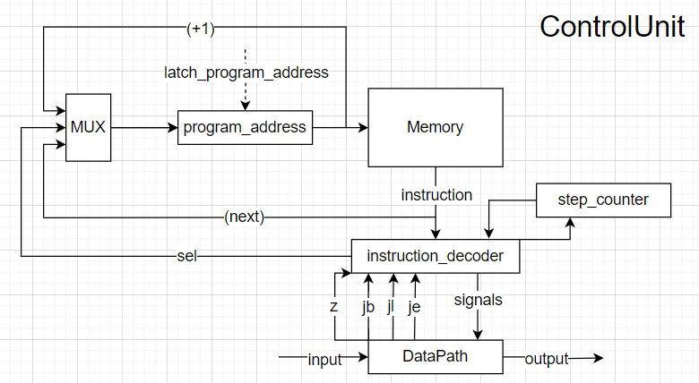

# Asm. Транслятор и модель

- Филатов Фёдор Романович
- `asm | cisc -> risc | neum | hw | instr | struct | stream | port | cstr | prob1 | cache`
- Без усложнения.


## Язык программирования

``` ebnf
program ::= { line }

line ::= label [ comment ] "\n"
       | instr [ comment ] "\n"
       | [ comment ] "\n"

label ::= label_name ":"

instr ::= op0
        | op1 positive_integer
        | op2 positive_integer, type
        | op3 address 

op0 ::= "inc"
      | "dec"
      | "halt"

op1 ::= "mov"
      | "add"
      | "sub"
      | "mul"
      | "div"
      | "rmd"
      | "cmp"
      | "in"

op2 ::= "out"

op3 ::= "jmp"
      | "jz"
      | "je"
      | "jb"
      | "jl"

address ::= lable_name
          | positive_integer

positive_integer ::= [0-9]+

type ::= "str"
      | "numb"

label_name ::= <any of "a-z A-Z _">

comment ::= ";" <any symbols except "\n">
```
Поддерживаются однострочные комментарии, начинающиеся с ;.
Код выполняется последовательно, одна инструкция за другой.
В строковых переменных перенос строки обозначается специальным символом `$`.

Список доступных инструкций см. [система команд](#система-команд)

## Организация памяти

Модель памяти процессора:

+ Фон-Неймановская архитектура – общая память для инструкций и данных
+ Размер машинного слова не определен (данные в памяти представляют собой структуры данных)
+ В случае переполнения регистров доступной памяти в начале выполнения будет выброшено исключение

Память адресуется двумя регистрами:
+ `ar` – регистр адреса для обращения к памяти из DataPath
+ `ap` – регистр адреса для обращения к памяти из ControlUnit

### Организация памяти при выполнении
```text
           Registers
+------------------------------+
| acc  ap  ar                  |
+------------------------------+

  Instruction and data memory
+------------------------------+
| 00   : program start         |
|     ...                      |
| n    : hlt                   |
| n+1  : value                 |
| n+2  : value                 |
|     ...                      |
+------------------------------+
```
В языке отсутствуют константы и литералы. Можно создавать переменные в части кода, которая идет после `.data:`.
Численные переменные занимаю одну ячейку памяти, строковые переменные хранятся последовательно в памяти и оканчиваются
специальным символом `\0`.

В коде программы к переменным можно обращаться по имени, которое задается в `.data:`. В процессе трансляции все имена 
переменных заменяются на адреса этих переменных в памяти.


## Система команд

Особенности процессора:

- Машинное слово -- не определено (CISC архитектура).
- Доступ к памяти данных осуществляется по адресу, хранящемуся в специальном регистре `data_address`. 
- Доступ к текущей инструкции осуществляется по адресу, хранящемуся в специальном регистре `program_address`.
- Напрямую установка адреса недоступна, осуществляется неявно внутри команд операторов, команд переходов и внутри команд загрузки, выгрузки памяти.
- Обработка данных происходит при помощи операторов `inc`, `dec`, `add`, `sub`, `mul`, `div`, `rmd`
- Поток управления:
    - инкремент `pc` после каждой инструкции;
    - условный (`jz`, `je`, `jb`, `jl`) и безусловный (`jmp`, `mov`) переходы
    - `counter` для выполнения команд требующих больше одного такта  
- Устройства ввода вывода используется при помощи портов
    - Для доступа к устройству вывода используется команда `out { port, type }`
    - Для доступа к устройству ввода используется команда `in { port }`, `in { port, address }`

Набор инструкций:

- `mov { address }` -- безусловный переход по заданному адресу (используется для DataPath)
- `mov { el1_addr, el2_addr, address }` -- поменять местами два элемента, используя промежуточный адрес
- `inc` -- увеличить значение в текущей ячейке на 1
- `dec` -- уменьшить значение в текущей ячейке на 1
- `add { el1_addr, el2_addr, address }` -- сложить произвольное количество элементов из памяти и положить в ячейку по указанному адресу (элементы берутся слева направо)
- `sub { el1_addr, el2_addr, address }` -- вычесть произвольное количество элементов из памяти и положить в ячейку по указанному адресу (элементы берутся слева направо)
- `mul { el1_addr, el2_addr, address }` -- перемножить произвольное количество элементов из памяти и положить в ячейку по указанному адресу (элементы берутся слева направо)
- `div { el1_addr, el2_addr, address }` -- поделить произвольное количество элементов из памяти и положить в ячейку по указанному адресу (элементы берутся слева направо)
- `rmd { el1_addr, el2_addr, address }` -- найти остаток от деления el1 на el2 и положить в ячейку по указанному адресу
- `cmp { el1_addr, el2_addr }` -- сравнить два элемента из памяти
- `jmp { address }` -- безусловный переход по заданному адресу или метке (используется для ControlUnit)
- `jz { address }` -- условный переход по заданному адресу или метке, если значение аккумулятора равно ноль
- `je { address }` -- условный переход по заданному адресу или метке, если в команде `cmp` первый элемент равен второму элементу
- `jb { address }` -- условный переход по заданному адресу или метке, если в команде `cmp` первый элемент больше второго элемента
- `jl { address }` -- условный переход по заданному адресу или метке, если в команде `cmp` первый элемент меньше второго элемента
- `in { port }` -- ввести извне значение и сохранить в аккумулятор (символ)
- `in { port, address }` -- ввести извне значение и сохранить в память начиная с текущей ячейки (последовательность символов)
- `out { port, type }` -- напечатать значение из текущей ячейки (символ)
- `halt` -- завершить выполнение программы

### Кодирование инструкций

- Машинный код сериализуется в список JSON.
- Один элемент списка -- одна инструкция.
- Индекс списка -- адрес инструкции. Используется для команд перехода.

Пример:

```json
[
  {
    "index": 0, 
    "operation": "add", 
    "arg": [21, 22, 23, 30]
  }
]
```

где:
- `index` -- адрес ячейки в памяти
- `operation` -- строка с кодом операции;
- `arg` -- аргумент (может отсутствовать);

## Транслятор

Интерфейс командной строки: `translator.py <input_file> <target_file>`

Реализовано в модуле: [translator](translator.py)

Этапы трансляции (функция `main`):

1. Очистка комментариев и лишних пробелов
2. Генерация машинного кода без адресов переходов
3. Подстановка меток перехода в инструкции.

## Модель процессора

Интерфейс командной строки: `machine.py <machine_code_file> <input_file>`

Реализовано в модуле: [machine](./machine.py).

### DataPath


Реализован в классе [DataPath](./data_path.py)

`memory` -- однопортовая память, поэтому либо читаем, либо пишем.

Сигналы (обрабатываются за один такт, реализованы в виде методов класса):

- `latch_addr` -- защёлкнуть выбранное значение в `data_addr`;
- `latch_acc` -- защёлкнуть в аккумулятор выбранное значение;
  - выход из памяти
  - результат операции в алу
  - значение из порта ввода 
- `wr` -- записать значение в память;
  - выход из аккумулятора
  - результат операции в алу
  - значение из порта ввода
- `signal_output` -- записать аккумулятор в порт вывода.
  - Строкой
  - Числом

Сигналы для ControlUnit:

- `z` -- отражает наличие нулевого значения в аккумуляторе.
- `je` -- отражает результат операции сравнения алу (первый элемент равен второму).
- `jl` -- отражает результат операции сравнения алу (первый элемент меньше второго).
- `jb` -- отражает результат операции сравнения алу (первый элемент больше второго).

### ControlUnit



Реализован в классе [ControlUnit](./control_unit.py)

- `program_address` - регистр указатель на исполняемую инструкцию в памяти
- `out_register` - регистр, содержащий условие для выполнения команды `out`

- Hardwired (реализовано полностью на Python).
- Метод `start` моделирует выполнение полного цикла инструкции.
- Counter реализован неявно внутри метода `start`

Сигнал:

- `latch_program_address` -- сигнал для обновления счётчика команд в ControlUnit.
  - +1
  - адрес из команды
- `latch_or` -- сигнал для обновления значения в `out_register`

Особенности работы модели:

- Цикл симуляции осуществляется в функции `start`.
- Шаг моделирования соответствует одной инструкции с выводом состояния в журнал.
- Для журнала состояний процессора используется стандартный модуль `logging`.
- Количество инструкций для моделирования лимитировано (10000).
- Остановка моделирования осуществляется при:
    - превышении лимита количества выполняемых инструкций;
    - превышении лимита памяти
    - при превышении лимита в ячейке памяти

## Тестирование

Тестирование выполняется при помощи golden test-ов.

Тесты реализованы в: [golden_test.py](./golden_test.py)
Конфигурации:
- [golden/cat.yml](golden/cat.yml)
- [golden/hello.yml](golden/hello.yml)
- [golden/hello_user.yml](golden/hello_user.yml)
- [golden/prob1.yml](golden/prob1.yml)
- [golden/additional_test.yml](golden/additional_test.yml)

Запустить тесты: `poetry run pytest . -v`

Обновить конфигурацию golden tests:  `poetry run pytest . -v --update-goldens`

CI при помощи Github Action:

``` yaml
name: Python CI

on:
  push:
    branches:
      - master
  pull_request:
    branches:
      - master

defaults:
  run:
    working-directory: ./

jobs:
  test:
    runs-on: ubuntu-latest

    steps:
      - name: Checkout code
        uses: actions/checkout@v4

      - name: Set up Python
        uses: actions/setup-python@v4
        with:
          python-version: 3.11

      - name: Install dependencies
        run: |
          python -m pip install --upgrade pip
          pip install poetry
          poetry install

      - name: Run tests and collect coverage
        run: |
          poetry run coverage run -m pytest .
          poetry run coverage report -m
        env:
          CI: true

  lint:
    runs-on: ubuntu-latest

    steps:
      - name: Checkout code
        uses: actions/checkout@v4

      - name: Set up Python
        uses: actions/setup-python@v4
        with:
          python-version: 3.11

      - name: Install dependencies
        run: |
          python -m pip install --upgrade pip
          pip install poetry
          poetry install

      - name: Check code formatting with Ruff
        run: poetry run ruff format --check .

      - name: Run Ruff linters
        run: poetry run ruff check .
```

Пример использования и журнал работы процессора на примере `cat`:

``` commandline
(.venv) PS D:\2_year\2_half\AC\lab3> cat .\tests\cat.txt
.code:
    loop:
        jz break    ; Комментарий
        in 0
        out 1 str
        jmp loop
    break:
        halt
(.venv) PS D:\2_year\2_half\AC\lab3> cat .\input_for_tests\input_for_test_cat.txt
a
b
c
Hello
(.venv) PS D:\2_year\2_half\AC\lab3> python ./translator.py .\tests\hello_user.txt .\machine_code.txt
source LoC: 8 code instr: 5
============================================================
(.venv) PS D:\2_year\2_half\AC\lab3> cat .\machine_code.txt
[{"index": 0, "operation": "jz", "arg": [4]},
{"index": 1, "operation": "in", "arg": [0]},
{"index": 2, "operation": "out", "arg": [1, "str"]},
{"index": 3, "operation": "jmp", "arg": [0]},
{"index": 4, "operation": "halt"}]
(.venv) PS D:\2_year\2_half\AC\lab3> python .\machine.py .\tests\cat.txt .\input_for_tests\input_for_test_cat.txt
DEBUG   control_unit:start         PC: 0 TICK: 0 P_ADDR: 0 MEM_ADDR: 0 ACC: 0 COMMAND: jz [4]
DEBUG   control_unit:start         PC: 1 TICK: 1 P_ADDR: 1 MEM_ADDR: 0 ACC: 0 COMMAND: in [0]
DEBUG   isa:perform       input: "a"
DEBUG   control_unit:start         PC: 2 TICK: 3 P_ADDR: 2 MEM_ADDR: 0 ACC: 97 COMMAND: out [1, 'str']
DEBUG   isa:perform       out: "" << "a"
DEBUG   control_unit:start         PC: 3 TICK: 5 P_ADDR: 3 MEM_ADDR: 0 ACC: 97 COMMAND: jmp [0]
DEBUG   control_unit:start         PC: 4 TICK: 6 P_ADDR: 0 MEM_ADDR: 0 ACC: 97 COMMAND: jz [4]
DEBUG   control_unit:start         PC: 5 TICK: 7 P_ADDR: 1 MEM_ADDR: 0 ACC: 97 COMMAND: in [0]
DEBUG   isa:perform       input: "\n"
DEBUG   control_unit:start         PC: 6 TICK: 9 P_ADDR: 2 MEM_ADDR: 0 ACC: 10 COMMAND: out [1, 'str']
DEBUG   isa:perform       out: "a" << "\n"
DEBUG   control_unit:start         PC: 7 TICK: 11 P_ADDR: 3 MEM_ADDR: 0 ACC: 10 COMMAND: jmp [0]
DEBUG   control_unit:start         PC: 8 TICK: 12 P_ADDR: 0 MEM_ADDR: 0 ACC: 10 COMMAND: jz [4]
DEBUG   control_unit:start         PC: 9 TICK: 13 P_ADDR: 1 MEM_ADDR: 0 ACC: 10 COMMAND: in [0]
DEBUG   isa:perform       input: "b"
DEBUG   control_unit:start         PC: 10 TICK: 15 P_ADDR: 2 MEM_ADDR: 0 ACC: 98 COMMAND: out [1, 'str']
DEBUG   isa:perform       out: "a\n" << "b"
DEBUG   control_unit:start         PC: 11 TICK: 17 P_ADDR: 3 MEM_ADDR: 0 ACC: 98 COMMAND: jmp [0]
DEBUG   control_unit:start         PC: 12 TICK: 18 P_ADDR: 0 MEM_ADDR: 0 ACC: 98 COMMAND: jz [4]
DEBUG   control_unit:start         PC: 13 TICK: 19 P_ADDR: 1 MEM_ADDR: 0 ACC: 98 COMMAND: in [0]
DEBUG   isa:perform       input: "\n"
DEBUG   control_unit:start         PC: 14 TICK: 21 P_ADDR: 2 MEM_ADDR: 0 ACC: 10 COMMAND: out [1, 'str']
DEBUG   isa:perform       out: "a\nb" << "\n"
DEBUG   control_unit:start         PC: 15 TICK: 23 P_ADDR: 3 MEM_ADDR: 0 ACC: 10 COMMAND: jmp [0]
DEBUG   control_unit:start         PC: 16 TICK: 24 P_ADDR: 0 MEM_ADDR: 0 ACC: 10 COMMAND: jz [4]
DEBUG   control_unit:start         PC: 17 TICK: 25 P_ADDR: 1 MEM_ADDR: 0 ACC: 10 COMMAND: in [0]
DEBUG   isa:perform       input: "c"
DEBUG   control_unit:start         PC: 18 TICK: 27 P_ADDR: 2 MEM_ADDR: 0 ACC: 99 COMMAND: out [1, 'str']
DEBUG   isa:perform       out: "a\nb\n" << "c"
DEBUG   control_unit:start         PC: 19 TICK: 29 P_ADDR: 3 MEM_ADDR: 0 ACC: 99 COMMAND: jmp [0]
DEBUG   control_unit:start         PC: 20 TICK: 30 P_ADDR: 0 MEM_ADDR: 0 ACC: 99 COMMAND: jz [4]
DEBUG   control_unit:start         PC: 21 TICK: 31 P_ADDR: 1 MEM_ADDR: 0 ACC: 99 COMMAND: in [0]
DEBUG   isa:perform       input: "\n"
DEBUG   control_unit:start         PC: 22 TICK: 33 P_ADDR: 2 MEM_ADDR: 0 ACC: 10 COMMAND: out [1, 'str']
DEBUG   isa:perform       out: "a\nb\nc" << "\n"
DEBUG   control_unit:start         PC: 23 TICK: 35 P_ADDR: 3 MEM_ADDR: 0 ACC: 10 COMMAND: jmp [0]
DEBUG   control_unit:start         PC: 24 TICK: 36 P_ADDR: 0 MEM_ADDR: 0 ACC: 10 COMMAND: jz [4]
DEBUG   control_unit:start         PC: 25 TICK: 37 P_ADDR: 1 MEM_ADDR: 0 ACC: 10 COMMAND: in [0]
DEBUG   isa:perform       input: "H"
DEBUG   control_unit:start         PC: 26 TICK: 39 P_ADDR: 2 MEM_ADDR: 0 ACC: 72 COMMAND: out [1, 'str']
DEBUG   isa:perform       out: "a\nb\nc\n" << "H"
DEBUG   control_unit:start         PC: 27 TICK: 41 P_ADDR: 3 MEM_ADDR: 0 ACC: 72 COMMAND: jmp [0]
DEBUG   control_unit:start         PC: 28 TICK: 42 P_ADDR: 0 MEM_ADDR: 0 ACC: 72 COMMAND: jz [4]
DEBUG   control_unit:start         PC: 29 TICK: 43 P_ADDR: 1 MEM_ADDR: 0 ACC: 72 COMMAND: in [0]
DEBUG   isa:perform       input: "e"
DEBUG   control_unit:start         PC: 30 TICK: 45 P_ADDR: 2 MEM_ADDR: 0 ACC: 101 COMMAND: out [1, 'str']
DEBUG   isa:perform       out: "a\nb\nc\nH" << "e"
DEBUG   control_unit:start         PC: 31 TICK: 47 P_ADDR: 3 MEM_ADDR: 0 ACC: 101 COMMAND: jmp [0]
DEBUG   control_unit:start         PC: 32 TICK: 48 P_ADDR: 0 MEM_ADDR: 0 ACC: 101 COMMAND: jz [4]
DEBUG   control_unit:start         PC: 33 TICK: 49 P_ADDR: 1 MEM_ADDR: 0 ACC: 101 COMMAND: in [0]
DEBUG   isa:perform       input: "l"
DEBUG   control_unit:start         PC: 34 TICK: 51 P_ADDR: 2 MEM_ADDR: 0 ACC: 108 COMMAND: out [1, 'str']
DEBUG   isa:perform       out: "a\nb\nc\nHe" << "l"
DEBUG   control_unit:start         PC: 35 TICK: 53 P_ADDR: 3 MEM_ADDR: 0 ACC: 108 COMMAND: jmp [0]
DEBUG   control_unit:start         PC: 36 TICK: 54 P_ADDR: 0 MEM_ADDR: 0 ACC: 108 COMMAND: jz [4]
DEBUG   control_unit:start         PC: 37 TICK: 55 P_ADDR: 1 MEM_ADDR: 0 ACC: 108 COMMAND: in [0]
DEBUG   isa:perform       input: "l"
DEBUG   control_unit:start         PC: 38 TICK: 57 P_ADDR: 2 MEM_ADDR: 0 ACC: 108 COMMAND: out [1, 'str']
DEBUG   isa:perform       out: "a\nb\nc\nHel" << "l"
DEBUG   control_unit:start         PC: 39 TICK: 59 P_ADDR: 3 MEM_ADDR: 0 ACC: 108 COMMAND: jmp [0]
DEBUG   control_unit:start         PC: 40 TICK: 60 P_ADDR: 0 MEM_ADDR: 0 ACC: 108 COMMAND: jz [4]
DEBUG   control_unit:start         PC: 41 TICK: 61 P_ADDR: 1 MEM_ADDR: 0 ACC: 108 COMMAND: in [0]
DEBUG   isa:perform       input: "o"
DEBUG   control_unit:start         PC: 42 TICK: 63 P_ADDR: 2 MEM_ADDR: 0 ACC: 111 COMMAND: out [1, 'str']
DEBUG   isa:perform       out: "a\nb\nc\nHell" << "o"
DEBUG   control_unit:start         PC: 43 TICK: 65 P_ADDR: 3 MEM_ADDR: 0 ACC: 111 COMMAND: jmp [0]
DEBUG   control_unit:start         PC: 44 TICK: 66 P_ADDR: 0 MEM_ADDR: 0 ACC: 111 COMMAND: jz [4]
DEBUG   control_unit:start         PC: 45 TICK: 67 P_ADDR: 1 MEM_ADDR: 0 ACC: 111 COMMAND: in [0]
DEBUG   isa:perform       input: "\n"
DEBUG   control_unit:start         PC: 46 TICK: 69 P_ADDR: 2 MEM_ADDR: 0 ACC: 10 COMMAND: out [1, 'str']
DEBUG   isa:perform       out: "a\nb\nc\nHello" << "\n"
DEBUG   control_unit:start         PC: 47 TICK: 71 P_ADDR: 3 MEM_ADDR: 0 ACC: 10 COMMAND: jmp [0]
DEBUG   control_unit:start         PC: 48 TICK: 72 P_ADDR: 0 MEM_ADDR: 0 ACC: 10 COMMAND: jz [4]
DEBUG   control_unit:start         PC: 49 TICK: 73 P_ADDR: 1 MEM_ADDR: 0 ACC: 10 COMMAND: in [0]
DEBUG   control_unit:start         PC: 50 TICK: 75 P_ADDR: 2 MEM_ADDR: 0 ACC: 0 COMMAND: out [1, 'str']
DEBUG   control_unit:start         PC: 51 TICK: 77 P_ADDR: 3 MEM_ADDR: 0 ACC: 0 COMMAND: jmp [0]
DEBUG   control_unit:start         PC: 52 TICK: 78 P_ADDR: 0 MEM_ADDR: 0 ACC: 0 COMMAND: jz [4]
DEBUG   control_unit:start         PC: 53 TICK: 80 P_ADDR: 4 MEM_ADDR: 0 ACC: 0 COMMAND: halt []
```

Пример проверки исходного кода:

``` commandline
(.venv) PS D:\2_year\2_half\AC\lab3> poetry run pytest . -v                 
============================================ test session starts ============================================
platform win32 -- Python 3.10.7, pytest-8.2.1, pluggy-1.5.0 -- D:\2_year\2_half\AC\lab3\.venv\Scripts\python.exe
cachedir: .pytest_cache
rootdir: D:\2_year\2_half\AC\lab3
configfile: pyproject.toml
plugins: golden-0.2.2
collected 5 items                                                                                                                                                                  

golden_test.py::test_translator_and_machine[golden/additional_test.yml] PASSED                          [ 20%]
golden_test.py::test_translator_and_machine[golden/cat.yml] PASSED                                      [ 40%]
golden_test.py::test_translator_and_machine[golden/hello.yml] PASSED                                    [ 60%]
golden_test.py::test_translator_and_machine[golden/hello_user.yml] PASSED                               [ 80%]
golden_test.py::test_translator_and_machine[golden/prob1.yml] PASSED                                    [100%]

============================================ 5 passed in 1.26s ============================================
(.venv) PS D:\2_year\2_half\AC\lab3>  
```

```text
| ФИО                     | алг        | LoC  | code байт | code инстр. | инстр.    | такт.    | вариант |
| Филатов Фёдор Романович | cat        | 8    | -         | 5           | 53        | 80       | -       |
| Филатов Фёдор Романович | hello      | 10   | -         | 5           | 38        | 74       | -       |
| Филатов Фёдор Романович | hello_user | 26   | -         | 17          | 152       | 310      | -       |
| Филатов Фёдор Романович | prob1      | 28   | -         | 16          | 9461      | 36374    | -       |
```